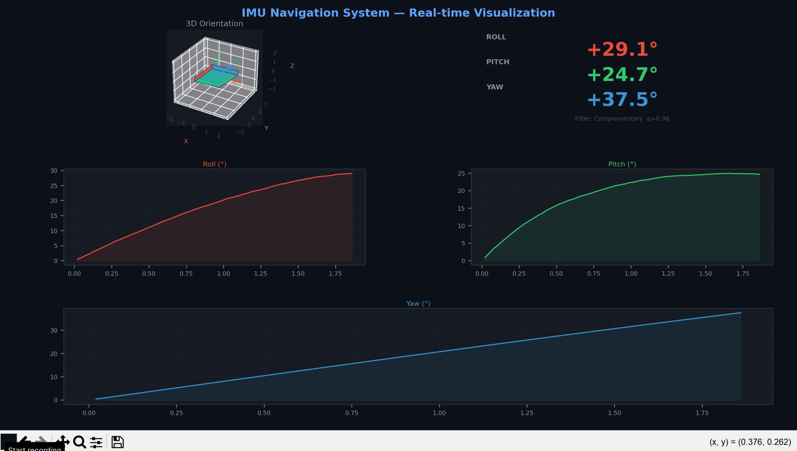

# 🧭 IMU Navigation System


 

**EN** | [MN](#-тойм-монгол)

---

Real-time IMU (Inertial Measurement Unit) sensor data processing and 3D orientation visualization system built with Arduino and Python. Implements a **Complementary Filter** to fuse accelerometer and gyroscope data for stable orientation estimation.

Arduino болон Python ашиглан бодит цагийн IMU мэдрэгчийн өгөгдлийг боловсруулж, 3D чиглэлийг дүрслэн харуулах систем. Accelerometer болон Gyroscope-ийн өгөгдлийг нэгтгэхдээ **Complementary Filter** алгоритм ашигладаг.

---

## 📺 Demo



---

## 🎯 Overview / Тойм

| | English | Монгол |
|---|---|---|
| **Sensor** | MPU-6050 (Accel + Gyro) | MPU-6050 мэдрэгч |
| **Algorithm** | Complementary Filter α=0.96 | Нэгдсэн шүүлтүүр |
| **Interface** | Arduino → Python Serial | Arduino → Python холболт |
| **Visualization** | Real-time 3D + 2D graphs | Бодит цагийн 3D + 2D график |
| **Mode** | Simulation & Hardware ready | Дуурайлга ба Hardware горим |

---

## 🧠 How It Works / Хэрхэн ажилладаг

```
MPU-6050 Sensor (Arduino)
        │
        │  Serial (9600 baud)
        ▼
  serial_reader.py
        │
        ▼
┌──────────────────────────────────────┐
│        Complementary Filter          │
│                                      │
│  angle = α × (angle + gyro × dt)    │
│        + (1-α) × acc_angle          │
│                                      │
│  Gyroscope     → 96%  (хурдан)      │
│  Accelerometer →  4%  (тогтвортой)  │
└──────────────────────────────────────┘
        │
        ▼
  3D Visualization + CSV Logger
```

### Why Complementary Filter? / Яагаад энэ алгоритм?

| Мэдрэгч / Sensor | Давуу тал / Advantage | Сул тал / Disadvantage |
|---|---|---|
| Accelerometer | Drift байхгүй / No drift | Шуугиантай / Noisy |
| Gyroscope | Хурдан, нарийн / Fast & precise | Цаг хугацаанд буруудна / Drifts |
| **Хоёулаа / Combined** | **Хурдан + Тогтвортой ✅** | — |

---

## 📁 Project Structure / Төслийн бүтэц

```
imu-navigation-system/
│
├── 📁 arduino/
│   └── imu_reader.ino      # MPU-6050 өгөгдөл уншигч / Data acquisition
│
├── 📁 python/
│   ├── simulate.py         # IMU дуурайлга / Simulator (no hardware needed)
│   ├── filter.py           # Complementary Filter
│   ├── visualizer.py       # 3D + 2D дүрслэл / Visualization
│   └── main.py             # Үндсэн файл / Entry point
│
├── 📁 data/
│   └── session_*.csv       # Хадгалсан өгөгдөл / Logged sessions
│
├── 📁 notebooks/
│   └── analysis.ipynb      # Шинжилгээ / Analysis
│
├── requirements.txt
└── README.md
```

---

## 🚀 Quick Start / Эхлэх заавар

### 1. Clone & Install / Суулгах

```bash
git clone git@github.com:ganbayar-gantulga/imu-navigation-system.git
cd imu-navigation-system

conda create -n imu-nav python=3.11
conda activate imu-nav

conda install numpy matplotlib scipy -y
pip install pyserial
```

### 2. Simulation Mode / Дуурайлга горим (Hardware шаардахгүй)

```bash
python python/main.py --mode simulate
```

### 3. Arduino Mode / Arduino горим (Hardware шаардлагатай)

```bash
# arduino/imu_reader.ino-г эхлээд Arduino руу upload хийнэ
python python/main.py --mode arduino --port COM3
```

### 4. Save Data / Өгөгдөл хадгалах

```bash
python python/main.py --mode simulate --save
```

---

## 📊 Visualization / Дүрслэл

```
┌─────────────────┬──────────────────┐
│                 │  ROLL   +23.4°   │
│   3D Board      │  PITCH  -12.1°   │
│   (rotating)    │  YAW    +45.2°   │
│                 │                  │
├────────┬────────┤                  │
│  Roll  │ Pitch  │                  │
├────────┴────────┴──────────────────┤
│  Yaw                               │
└────────────────────────────────────┘
```

---

## 🔌 Arduino Wiring / Холболт (MPU-6050)

| MPU-6050 Pin | Arduino Uno Pin |
|---|---|
| VCC | 5V |
| GND | GND |
| SCL | A5 |
| SDA | A4 |

---

## 📈 Filter Performance / Шүүлтүүрийн нарийвчлал

| Цаг / Time | Roll (filtered) | Roll (true) | Алдаа / Error |
|---|---|---|---|
| 0.10s | +5.23° | +5.89° | 0.66° |
| 0.50s | +18.45° | +18.92° | 0.47° |
| 1.00s | +29.12° | +29.34° | 0.22° |

---

## 🗺️ Roadmap / Цааш хийх зүйлс

- [x] IMU data simulator / Дуурайлга
- [x] Complementary Filter
- [x] Real-time 3D visualization / Бодит цагийн дүрслэл
- [x] CSV data logger / Өгөгдөл хадгалах
- [ ] Arduino hardware integration / Hardware холболт
- [ ] Kalman Filter comparison / Харьцуулалт
- [ ] Jupyter notebook analysis / Шинжилгээ
- [ ] Magnetometer — Yaw drift correction / Луужин мэдрэгч

---

## 📚 Key Concepts Learned / Сурсан зүйлс

| Англи | Монгол |
|---|---|
| Hardware-Software integration | Arduino ↔ Python Serial холболт |
| Signal processing | Мэдрэгчийн өгөгдөл боловсруулалт |
| Real-time systems | Бодит цагийн өгөгдөл дамжуулалт |
| Rotation mathematics | Euler өнцөг, эргэлтийн матриц |
| Sensor fusion | Олон мэдрэгчийн өгөгдөл нэгтгэх |

---

## 👤 Author / Хөгжүүлэгч

**Ganbayar Gantulga**
[GitHub](https://github.com/ganbayar-gantulga) · [Portfolio](https://github.com/ganbayar-gantulga?tab=repositories)

---

## 📄 License

MIT License — feel free to use and modify. / Чөлөөтэй ашиглаж болно.
